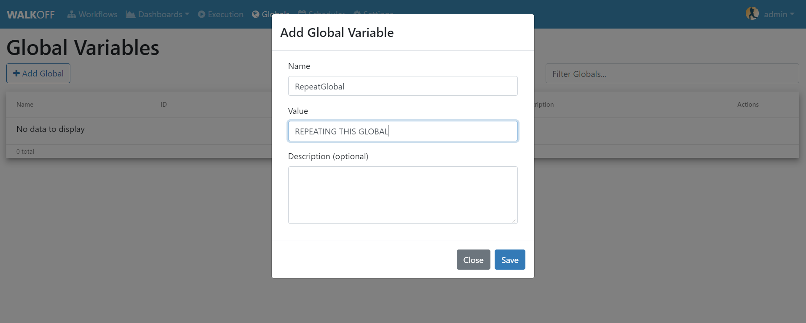
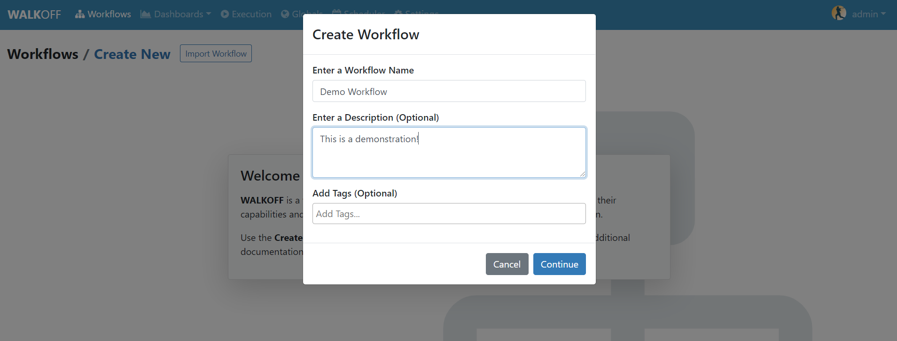
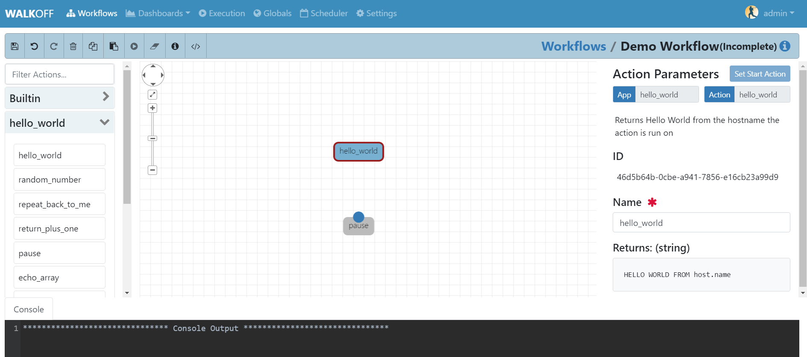
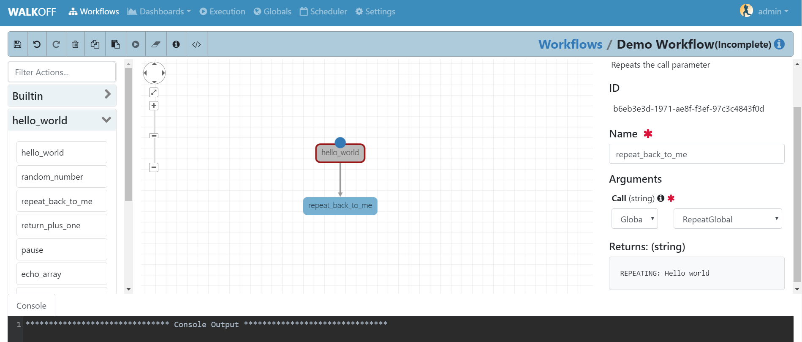
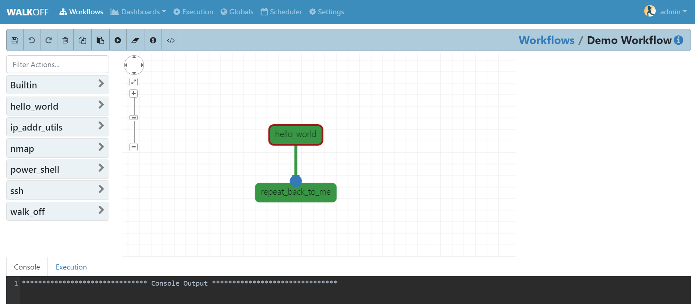
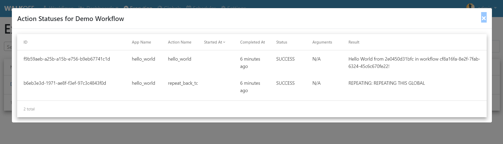
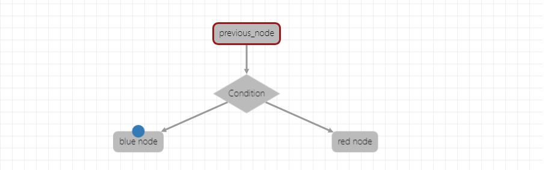

.. _workflow_dev:

.. |br| raw:: html

   
  
Workflow Development
====================
Below you can find information about how to create a workflow as well as the tools that are available to you as a user.

Workflow Creation
-----------------
In this tutorial, we will create our first, basic workflow in order to demonstrate the general features of the workflow editor.

.. _create-global:
Create Global
'''''''''''''
	Before we create a workflow, we will create a global that our actions will use.
	
	In the top navigation bar, click on ``Globals``, then ``Add Global``. Fill out the required fields for this example and set the value to an integer between 1-10. Then click ``Save`` in the dialog box. If nothing is populated in the globals table then verify that you created your encryption key by going to 
	:ref:`encryption-label`.
	

Create Workflow
'''''''''''''''
	In the top navigation bar, click ``Workflows`` to return to the main Workflow page. Then, near the top of the page, click the ``Create New`` button. Here you can enter a name for a new workflow. Once you enter the name and have filled out the other fields (optional) click "Continue"

	
Add Actions to Workspace
''''''''''''''''''''''''
	Let's begin by adding a Hello World action and a Pause action from the HelloWorld app. Expand the HelloWorld app by clicking on the app name in the left pane. Then, double-click, or click and drag the desired actions into the workspace.
	
	Ensure that the Hello World action is set as the starting node by clicking ``Set as Start Action`` in the Action Parameters pane.

Configure Options
'''''''''''''''''
	Some actions will have inputs; some required, some optional. In this case, the pause action requires a parameter, but the hello_world action does not. Set the pause parameter's type to ``global`` from the dop down and select the global that you created in the previous examples. The global that you set is the amount of time that the pause action will pause for.
	
	Finally, connect the actions together by clicking and dragging from the top of the hello_world action to the top of the pause action.

Save and Execute Workflow
'''''''''''''''''''''''''
	Use the Save button and the Execute button in the toolbar.

Examine Results:
''''''''''''''''
	Now you can either check the results of your workflow under the ``Execution`` tab below your workflow, or you can navigate to the ``Execution`` tab at the top of the screen for a more organized view of your app. If everything was configured properly you can expect to see results identical to what is shown below.

|br|

Workflow Editor
---------------
In this tutorial, we will explore the different components of the Workflow Editor interface.

.. _toolbar-label:
Toolbar
''''''''
From left to right, the buttons in the toolbar are: 

+-----------------------+-----------------------------------------------+
|   Save Workflow       | Saves current workflow under specified name	|
+-----------------------+-----------------------------------------------+
|        Undo	       	| Reverts the most recent change in the editor	|
+-----------------------+-----------------------------------------------+
|        Redo	       	|   Reapplies the most recent undone action	|
+-----------------------+-----------------------------------------------+
| Delete Selected Nodes	|    Deletes the selected Action or Edge	|
+-----------------------+-----------------------------------------------+
|        Copy		|        Copies the selected Action		|
+-----------------------+-----------------------------------------------+
|        Paste		|  Pastes the previously copied or cut Action	|
+-----------------------+-----------------------------------------------+
|    Execute Workflow	|  Schedules the Workflow to run immediately	|
+-----------------------+-----------------------------------------------+
| Clear Execution 	|   Clears the green/ red highlighting of 	|
| Results		|   executed actions				|
+-----------------------+-----------------------------------------------+
|    Edit Description	|  Allows you to edit the description of the 	|
|			|  workflow you are currently working on	|
+-----------------------+-----------------------------------------------+
|    Create Variable	| Creates workflow variabe that is local to the	|
|			| workflow you are currently working on		|
+-----------------------+-----------------------------------------------+

Highlighting
''''''''''''
	Selected Actions or Edges will be highlighted in blue. Actions that have been executed successfully during a run will be highlighted in green, while ones that have encountered errors will be highlighted in red.
	
Apps and Actions
''''''''''''''''
	Apps and Actions that you have installed in your Walkoff instance will appear in the left pane. Click the name of an App to reveal the Actions that App provides. To use an Action from the pane, double click on the name of the Action or click and drag the Action into the workspace.

Navigating Workspace
''''''''''''''''''''
	The workspace can be navigated using the buttons in the top left of the pane. From top to bottom, these buttons can be used to pan, zoom to fit, or zoom in and out. You can also click and drag on an empty area to pan, and use the scroll wheel to zoom in and out.

Connecting Actions Together
'''''''''''''''''''''''''''
	When hovering over the top edge of an action, a red dot will appear. To create an edge from one action to the next, click and drag from the red dot to the top of the next action in the sequence; an arrow will appear, linking the actions together.
An action can point to more than one action; these are called branches.

Branch Configuration
''''''''''''''''''''
	When an action is connected to more than one subsequent action, the path the workflow takes will not happen in any specific order. Since Walkoff operates on an asynchronous framework, multiple branches will execute at different times for different runs.

Editing Actions
'''''''''''''''
	When an Action is selected, its properties will appear in the right pane.
	
	The Action Parameters will include the App it came from, the Action it will perform, and the Name of the Action (separate from its unique ID). You can also set the starting Action of the Workflow in this pane.

|br|

Parameter Passing and Node Types (Buitin)
-----------------------------------------
Actions may have arguments, whose properties are defined by the App's API schema. By default, an argument is a static value that you specify. To use the output from an Action as an argument to another Action, select dropdown menu and select Action Output, the box to the right of it will then become a dropdown menu if it wasn't already. Select the action you wish to receive the output from (the action must be directly or indirectly linked to the current action). 

Parameter Passing
'''''''''''''''''
There are four different types of parameters you can pass to an action, static value, action output, globals, and workflow variables.

Static Value
~~~~~~~~~~~~
	 Static Value parameters are those that you explicitly set as you are building your workflow, in this case, hardcode the value you would like to use. 
	 
Action Output
~~~~~~~~~~~~~
	 Another option is to use action output from a previous node as the input parameter to the current one. If you use the action output, you must ensure that the node you're receiving output from is a predecessor. Using action results as inputs would be helpful when you are relying on data that was processed in a previous action. 

Global Variable
~~~~~~~~~~~~~~~
	The other type of parameter you can use is the global variable. This will be set at :ref:`create-global` and will be stored as an encrypted value. When your workflow calls the global, it will decrypt it at that moment and use the value stored using a docker secret. This can prove to be beneficial if you have an action that needs login credentials and you don't want to type them in for every workflow you create.  

Workflow Variable
~~~~~~~~~~~~~~~~~
	This type of variable is only visible within the scope of your workflow. This is useful in a similar situation to the global variables where you may want to create a variable that you know will need to be used multiple times in different actions. Rather than continuing to type in static value parameters create a workflow variable using the Create Variable button found in the  
	:ref:`toolbar-label`.

Node Types
''''''''''

Trigger
~~~~~~~
	Actions can wait on Triggers to fire before executing. To use one, select the ``Builtin`` app in the app bar. Either double click or drag the ``Trigger`` action to the workflow space. Fill out the appropriate arguments and connect the components as you would any other action. In order to use a trigger, you will need to grab the execution id found on the right side of the page and deliver an api call to /trigger as well as everything else need for a basic api call. Trigger api calls can be found at 
	:ref:`api_gateway`. 
	
Condition
~~~~~~~~~
	Actions can depend on Conditions in order to determine which branch of execution it would like to complete. If you would like to go down a right branch based on the output of another action, you would insert a condition from the builtin apps. Once you drag the condition in, write some simple python code such as 
	
	.. code-block:: console
		
		if previous_node.result.get('value') == 0:
			selected_node = blue_node
		elif previous_node.result.get('value') == 1:
			selected_node = red_node
			
	In this case the names of the variables must be separated by spaces. In the workflow 'blue node' and 'red node' have spaces between them, however when writing the conditional, you must separate them using underscores. The one thing you must ensure is that 'selected node' is set to a value in order for the condition node to select a branch it would like to traverse.

Parallel Action
~~~~~~~~~~~~~~~
	Another action type that isn't found in the Builtin Apps, is the Parallel Action. For apps that can be run as parallel actions, they will have an option that says ``Run in Parallel`` located in the right panel all the way at the bottom. If you select that drop down, it will give you all of the possible arguments to parallelize on for that specific action. This *should* speed up your workflow run time as it will spawn off individual actions for the array of values you would like to parallelize on. 
